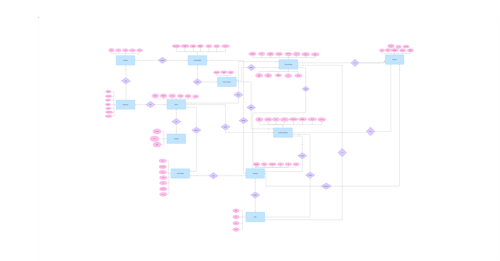
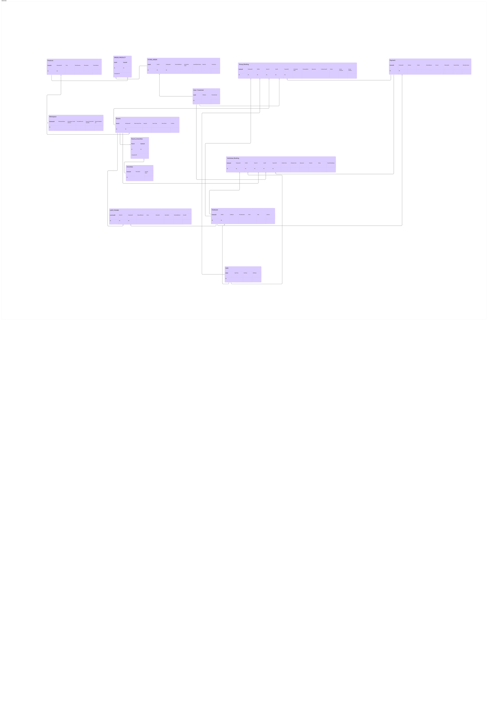

# Co-Working Space Booking System — Database

A fully normalized relational database for managing co-working space operations, designed and implemented in Oracle SQL. The schema covers room booking (individual and group), employee shift management, payment processing, lost and found tracking, and an integrated product store.

---

## Table of Contents

- [Project Overview](#project-overview)
- [Repository Structure](#repository-structure)
- [Entity-Relationship Diagram](#entity-relationship-diagram)
- [Relational Mapping](#relational-mapping)
- [Schema Overview](#schema-overview)
- [Business Rules and Constraints](#business-rules-and-constraints)
- [Design Decisions](#design-decisions)
- [Getting Started](#getting-started)

---

## Project Overview

This database models the complete operational lifecycle of a co-working space, from initial room configuration through booking, check-in, payment settlement, and post-visit store purchases.

| Domain | Tables |
|---|---|
| Space configuration | `WORKSPACE`, `ROOM`, `AMENITY`, `ROOM_AMENITY` |
| Customers | `CUSTOMER_USER` |
| Individual bookings | `INDIVIDUAL_BOOKING` |
| Group bookings | `GROUP_BOOKING` |
| Payments | `PAYMENT` |
| Staff and scheduling | `EMPLOYEE`, `SHIFT` |
| Lost and found | `LOST_FOUND` |
| Product store | `PRODUCT`, `STORE_ORDER`, `ORDER_ITEM` |

---

## Repository Structure

```
co-working-space-database/
│
├── README.md
│
├── schema/
│   └── co_working_space_database.sql       Oracle SQL — DDL, sequences, seed data, queries
│
└── docs/
    ├── ERD.pdf                             Entity-Relationship Diagram (source)
    ├── MAPPING.pdf                         Relational table mapping (source)
    └── ERD_Technical_Analysis.pdf          Full technical analysis report
```

---

## Entity-Relationship Diagram



The ERD shows all entities, their attributes, and the cardinality of every relationship across the system. Individual and group bookings are modelled as distinct entities sharing a conceptual booking supertype, each with its own lifecycle, billing logic, and status vocabulary.

---

## Relational Mapping



The relational mapping translates the ERD into a concrete table structure, annotating every column with its primary key, foreign key, and composite key designations.

---

## Schema Overview

### WORKSPACE
Top-level operational unit. Stores all system-wide configurable parameters: grace period, cancellation threshold, deposit rate, tax rate, and deposit payment window. All parameters apply only to newly created bookings when changed.

### ROOM
Physical room within a workspace. The `PrimaryType` column (`Individual` / `Group`) acts as the discriminator, replacing a separate room-type table. `BaseHourlyPrice` and `Capacity` are snapshotted at booking creation and cannot be retroactively modified.

### AMENITY and ROOM_AMENITY
Equipment and features associated with rooms (Wi-Fi, projector, gaming consoles, etc.). `ROOM_AMENITY` is a junction table resolving the many-to-many relationship. Every room must have at least one amenity on record.

### CUSTOMER_USER
Customer identity is defined by the composite natural key `(FullName, PhoneNumber)`, which must be unique. `UserID` is a surrogate key added for referential integrity. Email is optional.

### INDIVIDUAL_BOOKING
Single-seat reservation for an individual room. No end time is declared at creation — duration is computed at checkout as `CheckOutTime - CheckInTime`. `PriceSnapshot` locks the room rate at creation. Walk-in bookings skip the `Pending` status and begin directly at `Checked-In`.

Status lifecycle:
```
Pending --> Checked-In --> Checked-Out
                       --> Auto-Cancelled
                       --> Cancelled
```

### GROUP_BOOKING
Full-room reservation requiring a pre-scheduled time window and an upfront deposit. Billing always uses the booked duration regardless of early departure. The room is blocked for the entire window once the booking is confirmed.

Billing formulas:
```
Deposit   = PriceSnapshot x BookedDuration x DepositRatePercent
FinalBill = (PriceSnapshot x BookedDuration) - Deposit + TaxAmount
```

Status lifecycle:
```
Pending --> Confirmed --> Checked-In --> Completed
                                    --> Cancelled-Refunded
                                    --> Cancelled-Forfeited
                     --> No-Show
```

### PAYMENT
Financial transaction linked to either booking type. Individual bookings produce a single `Full` payment at checkout. Group bookings produce a `Deposit` payment at confirmation and a `Balance` payment at checkout. Refund fields track deposit returns on valid cancellations.

### EMPLOYEE and SHIFT
Staff members and their scheduled time windows. Each booking record carries three separate employee foreign keys — creation, check-in, and check-out — to support full audit traceability when different staff handle different stages of a booking.

### LOST_FOUND
Item log from discovery through resolution. Four fields are mandatory at entry: `Description`, `RoomID`, `FoundAt`, and `LoggedByEmpID`. Disposal records require an authorizing employee reference.

Status lifecycle: `Found --> Stored --> Claimed | Disposed`

### PRODUCT, STORE_ORDER, ORDER_ITEM
A self-contained store sub-system. A single shared product catalogue serves both online and on-site channels. `ORDER_ITEM` is the line-item junction table capturing quantity and price at the time of purchase. Store transactions are recorded independently from booking payments. Guest orders are supported via a nullable `UserID` on `STORE_ORDER`.

---

## Business Rules and Constraints

| Rule | Type | Description |
|---|---|---|
| BR-01-001 | CHECK | `PrimaryType` must be exactly one of `Individual` or `Group` |
| BR-01-002 | CHECK | Every room must have at least one entry in `ROOM_AMENITY` |
| BR-02-001 | BUSINESS | Price and capacity changes are prospective only; existing bookings retain their snapshot values |
| BR-02-002 | BLOCK | Room type cannot be changed while any active booking exists for that room |
| BR-03-001 | ENFORCE | Group booking remains `Pending` until the deposit payment is recorded |
| BR-03-003 | BUSINESS | Deposit is refundable only if cancellation occurs before the threshold; no-shows forfeit unconditionally |
| BR-04-002 | ENFORCE | Walk-in individual bookings skip `Pending` and begin directly at `Checked-In` |
| BR-04-004 | BLOCK | No two active individual bookings for the same user may have overlapping time ranges |
| BR-05-002 | BLOCK | No two confirmed group bookings for the same room may have overlapping windows |
| BR-05-003 | ENFORCE | Group bookings not checked in by `ScheduledStart` are automatically marked `No-Show` and the room is released |
| BR-05-004 | BUSINESS | Billing always uses `BookedDuration`; early departure does not reduce the charge |
| BR-07-001 | CHECK | No two shifts for the same employee on the same date may overlap |
| BR-07-002 | AUDIT | Every booking must reference the active `ShiftID` and `EmployeeID` at the time of creation |
| BR-07-003 | AUDIT | Check-in and check-out may be handled by different employees; each step stores a separate employee reference |
| BR-08-001 | NOT NULL | Lost and found entries require `Description`, `RoomID`, `FoundAt`, and `LoggedByEmpID` |
| BR-09-002 | CHECK | Products with `StockQuantity = 0` or `IsActive = N` cannot be purchased on either channel |
| BR-09-005 | ENFORCE | `StockQuantity` is shared across channels and must be decremented atomically on each sale |
| SYS-02 | ENFORCE | `PriceSnapshot` is immutable after booking creation |

---

## Design Decisions

**No separate ROOM_TYPE table.** Room type is stored as `PrimaryType` directly on the `ROOM` table. This eliminates a join on every booking query while keeping the CHECK constraint clean. A room's type cannot change while active bookings exist, so the discriminator is stable by design.

**Three-role employee pattern.** Both `INDIVIDUAL_BOOKING` and `GROUP_BOOKING` carry three separate employee foreign keys: `EmpID_Creation`, `EmpID_CheckIn`, and `EmpID_CheckOut`. This provides complete audit traceability for the full booking lifecycle without requiring a separate audit table, and supports the real-world case where shift handovers mean different staff process different stages.

**Price snapshot enforcement.** `PriceSnapshot` on each booking records the hourly rate at the moment of creation. This satisfies BR-02-001 and SYS-02: price changes at the workspace or room level never affect confirmed or pending bookings. The snapshot is a stored attribute, not a derivation, and is treated as immutable.

**Availability as a derived concept.** `AvailableSeats` and room availability are not stored columns. They are computed on demand:

```sql
AvailableSeats = Capacity
               - COUNT(bookings WHERE Status = 'Checked-In')
               - COUNT(bookings WHERE Status = 'Pending' AND GracePeriodExpiry > SYSDATE)
```

This avoids stale data and race conditions. The value can optionally be materialized as a view.

**Store sub-system independence.** `STORE_ORDER` and `ORDER_ITEM` are self-contained. The only link to the booking domain is a nullable `UserID` foreign key on `STORE_ORDER`, which supports guest purchases without requiring a user account. Store payments are entirely separate records from booking payments.

---

## Getting Started

This schema targets **Oracle SQL (Oracle 19c and above)**.

Open `schema/co_working_space_database.sql` in Oracle SQL Developer or any compatible Oracle client and execute the four sections in order.

**Section 1 — Create tables**

All 14 tables with full constraints, foreign keys, and CHECK rules.

**Section 2 — Create sequences**

Twelve Oracle sequences for surrogate primary key generation.

**Section 3 — Seed data** *(optional)*

Sample workspaces, rooms, employees, amenities, customers, bookings, and store orders for immediate testing.

**Section 4 — Verification queries**

Seven ready-to-run SELECT statements covering rooms, bookings, payments, and lost and found records.

A quick sanity check after setup:

```sql
SELECT RoomID, RoomName, PrimaryType, BaseHourlyPrice, Capacity, IsActive
FROM   ROOM
ORDER  BY PrimaryType, RoomName;
```

---

## Documentation

| File | Description |
|---|---|
| `docs/ERD.pdf` | Entity-Relationship Diagram — all entities, attributes, and relationship cardinality |
| `docs/MAPPING.pdf` | Relational table mapping with PK, FK, and composite key annotations |
| `docs/ERD_Technical_Analysis.pdf` | Full analyst report: entity catalogue, relationship table, constraint index, enum domains, and ERD construction notes |
